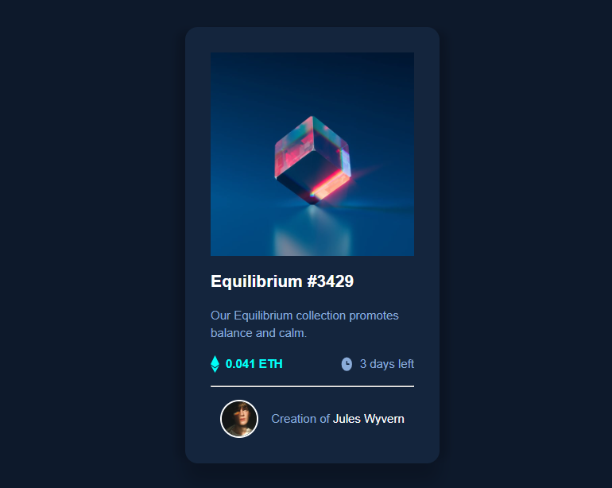

# Frontend Mentor - NFT preview card component solution

This is a solution to the [NFT preview card component challenge on Frontend Mentor](https://www.frontendmentor.io/challenges/nft-preview-card-component-SbdUL_w0U). Frontend Mentor challenges help you improve your coding skills by building realistic projects.

## Table of contents

- [Overview](#overview)
  - [The challenge](#the-challenge)
  - [Screenshot](#screenshot)
  - [Links](#links)
- [My process](#my-process)
  - [Built with](#built-with)
  - [What I learned](#what-i-learned)
- [Author](#author)

## Overview

### The challenge

Users should be able to:

- View the optimal layout depending on their device's screen size
- See hover states for interactive elements

### Screenshot



### Links

- Solution URL: [Github Repo](https://github.com/samoina/nft-preview-card)
- Live Site URL: [Netlify Link](https://your-live-site-url.com)

## My process

### Built with

- Semantic HTML5 markup
- CSS custom properties
- Flexbox
- Mobile-first workflow
- BEM

### What I learned

1. When adding an overlay for an image hovered upon, it is not possible to simply add the :hover pseudoselector for the image selector and expect it to work. I have learned that I would need to create an empty div within the parent image div, and then position it absolutely, with its background set to the chosen color and an opacity of 0.

The parent div must be positioned relative & have a width and height, for the overlay div to inherit. When the user hovers over the parent div, the overlay div covers it completely and the opacity changes to create the cyan overlay effect. Here's the code snippet for my approach:

```html
<div class="main__image">
	
	<div class="main__image--overlay"></div>
</div>
```

```css
.main__image {
	position: relative;
	overflow: hidden;
	height: 100%;
	width: 100%;
}

.main__image--nft {
	width: 100%;
	height: 100%;
	border-radius: 0.5rem;
}

.main__image--overlay {
	position: absolute;
	border-radius: 0.5rem;
	top: 0;
	left: 0;
	width: 100%;
	height: 100%;
	background-color: cyan;
	opacity: 0;
	transition: opacity 0.3s ease;
}

.main__image:hover .main__image--overlay {
	opacity: 0.5;
}
```

2. I also learned that when we use the ! in Markdown before adding an image, this is done to denote an inline image, which is then followed by the alt text in square brackets [], and then the path to the image. This as included in my screenshot section above.

```markdown

```

## Author

- Website - [Samoina Lives](https://samoinalives.wordpress.com/)
- Frontend Mentor - [Samoina](https://www.frontendmentor.io/profile/samoina)
- Twitter - [Samoina](https://www.twitter.com/samoina)
